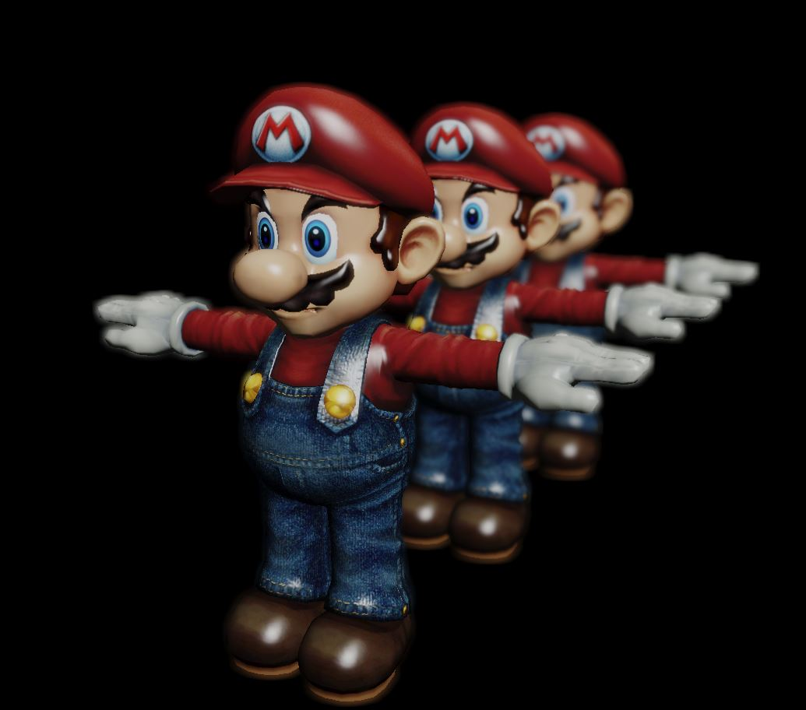
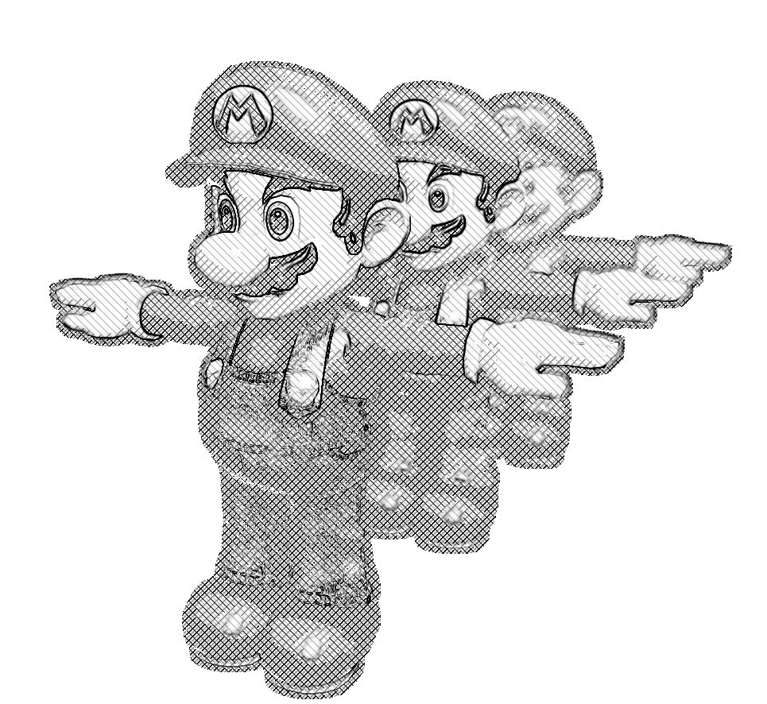
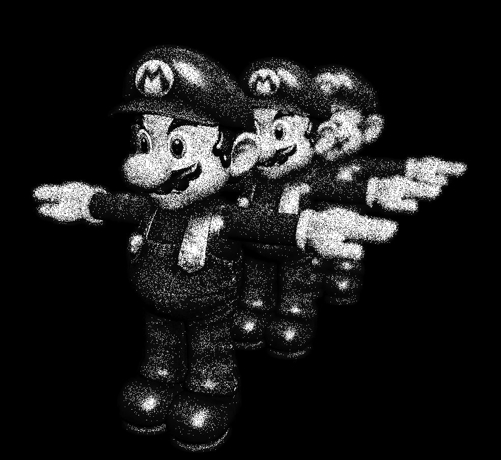
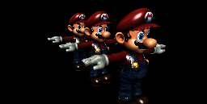
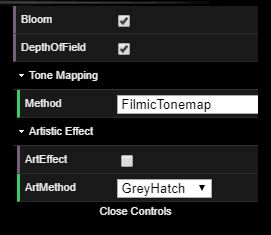

# Project 7: Deferred Renderer

* ***University of Pennsylvania, CGGT***
* ***Pennkey: jiaww***
* ***Jiawei Wang***
___

## Overview
* **Goal:** Using the OpenGL pipeline and apply it to make artistic procedural post-processing effects.
* [**Demo Link**](https://jiaww.github.io/homework-7-deferred-renderer-Jiaww/)
* **Final Results:**

|**Bloom + DOF + ToneMapping**|
|---|
||

* **Artistic Effects:**

|**Grey Hatch**|**Color Hatch**|
|---|---|
|||

|**Pointilism**|**Distorted TV**|
|---|---|
|||

## Implementation Details:
### Render pipeline overview
Each `tick()`, the provided `OpenGLRenderer` will perform the following operations:
1. `renderToGBuffer`: Render the 3D scene (`wahoo.obj`) into its G-Buffers using `standard-vert.glsl` and `standard-frag.glsl`. Note that the fragment shader has three outputs rather than just one; this is because it can write to each of the elements of `OpenGLRenderer`'s `gbTargets` array. The provided code just writes base albedo to the third `gbTarget` element. Here are what I store in GBuffers:
  * GBuffer0: `32 bits: x,y,z: world normals, w: NDC depth`
  * GBuffer1: `8 bits: x,y,z: specular color, w: specular roughness`
  * GBuffer2: `8 bits: x,y,z: albedo color, w: 1.0`

2. `renderFromGBuffer`: Render the data in its G-Buffers into the first element of its `post32Buffers` array, which stores 32-bit colors rather than 8-bit colors so that the scene can be represented using high dynamic range values. This render pass uses the fragment shader `deferred-render.glsl`, in the shader, firstly, I use NDC coordinates to find out the world position of the pixel, and then compute the light shading(Blinn-Phong) in world space.

3. `renderPostProcessHDR`: It contains following process:
  * **Depth of Field**: `renderDepthOfField(camera)`
  * **Bloom**:
  
    |**Extract Highlight**|**Gaussian Blur**|**Blend**|
    |---|---|---|
    ||||
    
    * `renderExtractHighlight()`: Extract highlight part of the deferred rendering result(after adding exposure, larger than 1.0)
    * `renderGaussianBlur()`: Blur the highlight part
    * `renderBloomBlend()`: Blend the blurred image with original one
    * Finally, ToneMapping: convert HDR image to LDR image
4. `renderPostProcessLDR`: Here is only for processing the LDR image, **The Artistic Effects**, I implemented 3 effects, they are as following:
  * **Hatching**: Mimics the illustration technique of representing darkness with diagonal lines, the reference is from shadertoy example [Crosshatch](https://www.shadertoy.com/view/MdX3Dr)
  * **Pointilism**: The speckled effect — basically represents darkness using density of speckles
    * We can approximate this density by applying color with some probability
    * Probability scales with original darkness value. Eg. if the original color was pure black, we color the pixel with 100% probability
    * We evaluate the darkness/brightness using: `float brightness = (0.2126*color.x) + (0.7152*color.y) + (0.0722*color.z);`
  * **Distorted TV**: Simulate a distorted effect like old television, the reference is from shadertoy example [Distorted TV](https://www.shadertoy.com/view/ldXGW4)

### GUI

|**Grey Hatch**|
|---|
||

## Credits:
* [***CIS 700 Procedural Graphics: Color and Shading***](https://cis700-procedural-graphics.github.io/files/color_2_14_17.pdf)
* [***Crosshatch***](https://www.shadertoy.com/view/MdX3Dr)
* [***Distorted TV***](https://www.shadertoy.com/view/ldXGW4)

